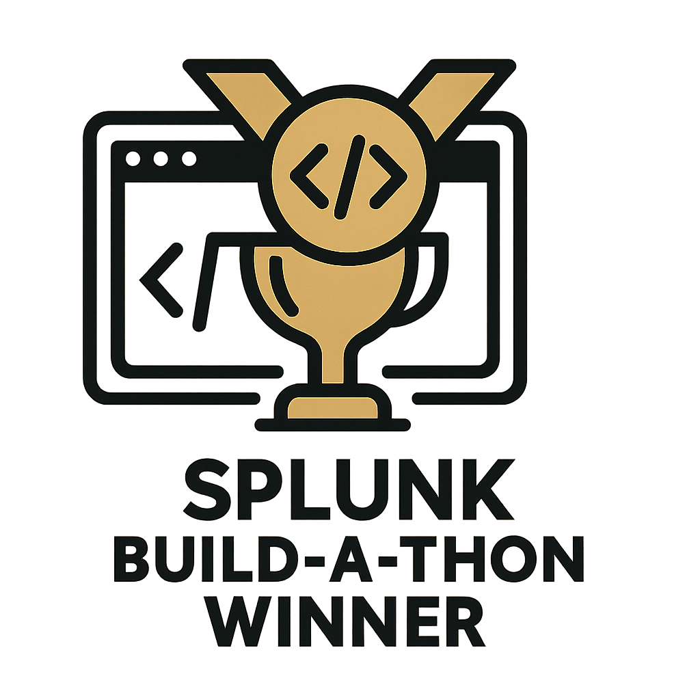

# CIMplicity AI - Splunk Data Onboarding Assistant

## Overview



CIMplicity AI is an intelligent Splunk app that automates the data onboarding process using AI-powered field extraction, CIM mapping, and PII detection. It helps Splunk administrators quickly configure new data sources with minimal manual effort.  
Check out the app at SplunkBase [https://splunkbase.splunk.com/app/7945](https://splunkbase.splunk.com/app/7945).

### Key Features

- 🤖 **AI-Powered Field Extraction**: Automatically detect and extract fields from log data
- 🗺️ **CIM Mapping**: Map extracted fields to Splunk Common Information Model (CIM)
- 🔒 **PII Detection**: Identify and redact Personally Identifiable Information
- ⚙️ **Configuration Generation**: Generate Splunk props.conf and transforms.conf automatically
- 📊 **Multiple Format Support**: JSON, CSV, Syslog, XML, and custom regex patterns

## Screenshots


## Installation

### Prerequisites

- Splunk Enterprise 9.0 or later
- Python 3.7+ (for backend services)
- Node.js 14+ (for development)

### Step 1: Install the App

1. Download the latest release from the releases page
2. Extract the app to `$SPLUNK_HOME/etc/apps/`
3. Restart Splunk Enterprise

### Step 2: Configure API Keys

The app requires API keys for AI-powered features. Configure them in the app's settings:
By default the AI completion endpoint is configured for OpenRouter, however any OpenAI compliant API can be used, such as a local LLM, ChatGPT (OpenAI) etc.  

1. Navigate to **Settings** → **Configuration** → **CIMplicity AI**
2. Enter your API keys in the respective fields
3. Save the configuration

### Step 3: Verify Installation

1. Navigate to **Apps** → **CIMplicity AI**
2. You should see the main wizard interface
3. Test with sample data to verify AI features are working

## Usage

### Quick Start

1. **Data Input**: Paste or upload your sample log data
2. **Field Extraction**: Use AI to automatically detect fields, or manually configure extraction
3. **CIM Mapping**: Map extracted fields to CIM data models
4. **PII Detection**: Scan for and configure PII redaction rules
5. **Configuration**: Generate and download Splunk configuration files

### Detailed Workflow

#### 1. Data Input Step

- **Supported Formats**: JSON, CSV, Syslog, XML, plain text
- **File Upload**: Drag and drop or browse for log files
- **Paste Data**: Directly paste log samples for analysis

#### 2. Field Extraction

- **Auto Detect**: AI-powered field detection with confidence scores
- **Custom Regex**: Manual regex pattern creation and testing
- **Timestamp Configuration**: Configure time parsing settings
- **Format Support**: 
  - Syslog (RFC3164, RFC5424, standard)
  - XML (simple tags, attributes, nested)
  - JSON (nested objects, arrays)
  - CSV (comma-separated, custom delimiters)

#### 3. CIM Mapping

- **Automatic Suggestions**: AI suggests CIM field mappings
- **Manual Override**: Customize mappings as needed
- **Validation**: Verify field types and formats
- **CIM Models**: Support for all major CIM data models

#### 4. PII Detection

- **Multiple Detectors**: Email, IP, credit cards, SSN, and more
- **Custom Patterns**: Add custom regex patterns
- **Redaction Preview**: See how data will look after redaction
- **Selective Redaction**: Choose which PII types to redact

#### 5. Configuration Generation

- **props.conf**: Field extraction and timestamp parsing
- **SPL2 Edge/Ingest Processor**: (Beta) Field extractions for SPL2 Ingestion
- **CIM Mapping**: Field aliases and data model compliance

## Configuration

### API Key Setup

#### OpenRouter (Recommended)

1. Sign up at [OpenRouter.ai](https://openrouter.ai) and add credits ($)
2. Generate an API key
3. Add to environment or app configuration
4. Test with sample data

#### Alternative Providers

- **OpenAI GPT / Anthropic Claude**: For high-accuracy field extraction
- **Local Models**: For offline/private deployments

### Advanced Settings

#### Field Extraction

```javascript
// Example: Custom timestamp format
TIME_FORMAT = "%Y-%m-%dT%H:%M:%S"
TIME_PREFIX = "^"
MAX_TIMESTAMP_LOOKAHEAD = "25"
```

#### PII Detection

```python
# Example: Custom PII detector
CUSTOM_PII_PATTERNS = {
    "employee_id": r"\bEMP\d{6}\b",
    "project_code": r"\bPRJ-[A-Z]{2}\d{4}\b"
}
```

## Development

### Local Development Setup
[See BUILD_GUIDE](docs/BUILD_GUIDE.md)

### Project Structure

```
splunk-app/
├── packages/
│   ├── ci-mplicity-home/     # Main React UI
│   └── cim-plicity/          # Splunk app backend
├── docs/                     # Documentation
├── ucc-app/                  # Universal Config Converter
└── README.md                 # This file
```

### Testing

```bash
# Run all tests
npm run test

# Run specific package tests
cd packages/ci-mplicity-home
npm run test

# Run linting
npm run lint
```

## Troubleshooting

### Common Issues

#### AI Features Not Working

1. **Check API Keys**: Verify API keys are correctly configured
2. **Network Access**: Ensure Splunk can reach external AI services
3. **Rate Limits**: Check API usage limits and quotas
4. **Logs**: Check Splunk logs for error messages

#### Field Extraction Issues

1. **Sample Data**: Ensure sample data is representative
2. **Format Detection**: Verify the correct format is detected
3. **Regex Patterns**: Test custom regex patterns separately
4. **Timestamp Parsing**: Check time format configuration

#### PII Detection Problems

1. **Detector Configuration**: Verify enabled detectors
2. **Sample Size**: Use sufficient sample data for detection
3. **Pattern Matching**: Test custom patterns with sample data
4. **Redaction Rules**: Check generated transforms.conf syntax


### Support

- **Documentation**: Check the `/docs` directory
- **Issues**: Report bugs on GitHub
- **Discussions**: Use GitHub Discussions for questions
- **Demo**: See `docs/DEMO_NARRATIVE.md` for video script

## Contributing

1. Fork the repository
2. Create a feature branch
3. Make your changes
4. Add tests for new functionality
5. Submit a pull request

### Development Guidelines

- Follow the existing code style
- Add tests for new features
- Update documentation as needed
- Test with multiple log formats
- Verify Splunk compatibility

## License

This project is licensed under the Apache License 2.0 - see the LICENSE file for details.

## Acknowledgments

- Splunk Common Information Model (CIM)
- OpenRouter for AI services
- React UI components
- Python scrubadub for PII detection

---

**Note**: This app is designed for the Splunk Build-a-Thon and demonstrates AI-powered data onboarding capabilities. For production use, additional security and performance considerations may be required.
