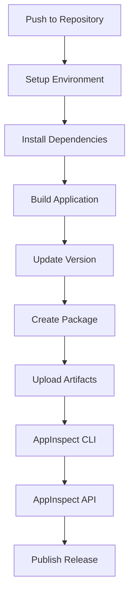

# CiMplicity Splunk App - Build Guide

## Overview

This document describes how to build the CiMplicity Splunk App project, both manually and through our automated CI/CD pipeline. The project is a monorepo managed with Lerna and Yarn, containing React-based Splunk UI components.

## Project Structure

```
splunk-app/
├── packages/
│   ├── ci-mplicity-home/     # Main React UI package
│   └── cim-plicity/          # Core Splunk app package
├── .github/workflows/        # CI/CD automation
├── docs/                     # Documentation
└── package.json             # Root package configuration
```

## Prerequisites

- **Node.js**: Version 14 or higher (recommended: 18)
- **Yarn**: Version 1.2 or higher
- **Python**: Version 3.9 (for backend components and UCC framework)
- **UCC Framework**: `pip install splunk-add-on-ucc-framework`
- **Git**: For version control

## Manual Build Process

### 1. Initial Setup

```bash
# Clone the repository
git clone <repository-url>
cd splunk-app

# Install yarn if not already installed
npm install --global yarn

# Install UCC framework
pip install splunk-add-on-ucc-framework

# Run initial setup (installs dependencies and builds packages)
yarn run setup
```

### 2. Development Build

```bash
# Install all dependencies
yarn install

# Generate UCC framework components
ucc-gen --source ucc-app -o build/

# Copy UCC files to React app structure
cp -R build/cim-plicity/* packages/cim-plicity/src/main/resources/splunk/

# Build all packages
yarn run build

# Start development servers (optional)
yarn run start
```

### 3. Individual Package Commands

```bash
# Run commands for specific packages
cd packages/ci-mplicity-home
yarn build        # Build just this package
yarn test         # Run tests for this package
yarn lint         # Run linting

# Or use lerna to run across all packages
yarn run test     # Run tests for all packages
yarn run lint     # Lint all packages
```

### 4. Production Build Output

After running `yarn run build`, the production-ready Splunk app will be available in:
```
packages/cim-plicity/stage/
```

This directory contains the complete Splunk app structure ready for installation.

## Development Scripts

The following scripts are available from the root directory:

| Script | Description |
|--------|-------------|
| `yarn run setup` | Initial setup: install dependencies and build all packages |
| `yarn run build` | Build all packages for production |
| `yarn run start` | Start development servers for all packages |
| `yarn run test` | Run unit tests across all packages |
| `yarn run lint` | Run ESLint and Stylelint across all packages |
| `yarn run format` | Auto-format code with Prettier |
| `yarn run format:verify` | Check code formatting without making changes |

## Automated CI/CD Pipeline

Our GitHub Actions workflow automates the build, test, and deployment process. The pipeline is defined in `.github/workflows/splunk-app-ci.yml`.

### Pipeline Overview



### Detailed Pipeline Steps

#### 1. Environment Setup
- **Ubuntu Latest**: Uses latest Ubuntu runner
- **Node.js 18**: Sets up Node.js with Yarn caching
- **Python 3.9**: Required for Splunk backend components
- **Git**: For version determination and tagging

#### 2. Version Determination
```bash
# Calculates version from git tags or defaults to 1.0.0
SHORT_COMMIT_HASH=$(git rev-parse --short HEAD)
if [[ "$GITHUB_REF" == refs/tags/* ]]; then
  TAG_VERSION=${GITHUB_REF#refs/tags/v}
else
  TAG_VERSION="1.0.0"
fi
VERSION_WITH_HASH="${TAG_VERSION}+${SHORT_COMMIT_HASH}"
```

#### 3. Dependency Installation
```bash
yarn install
```
- Uses Yarn for faster, deterministic installs
- Leverages GitHub Actions caching for dependencies
- Installs all monorepo dependencies

#### 4. UCC Framework Generation
```bash
ucc-gen --source ucc-app -o build/
cp -R build/cim-plicity/* packages/cim-plicity/src/main/resources/splunk/
```
- Generates UCC (Universal Configuration Console) components for credential management
- Creates configuration UI components and REST endpoints
- Copies generated files into the React app structure

#### 5. Build Process
```bash
yarn run build  # Equivalent to: lerna run build
```
- Builds all packages in dependency order
- Compiles React components with Babel
- Bundles JavaScript with Webpack
- Copies static assets and Splunk configuration files
- Generates the `stage/` directory with complete app

#### 6. Version Update and AppInspect Fixes
```bash
# Updates app.conf with calculated version (both [id] and [launcher] stanzas)
sed -i "s/version = .*/version = ${TAG_VERSION}/g" default/app.conf

# Update app.manifest version if it exists
sed -i "s/\"version\": \".*\"/\"version\": \"${TAG_VERSION}\"/g" app.manifest

# Update package id to match directory name
sed -i "s/id = .*/id = cim-plicity/g" default/app.conf

# Add reload trigger for custom config files
echo "[triggers]" >> default/app.conf
echo "reload.splunk_create = simple" >> default/app.conf

# Fix Python version in REST endpoints
sed -i '/python.version = python3/' default/restmap.conf
```

#### 7. Package Creation
```bash
# Creates distribution tarballs with proper directory structure
mkdir -p temp-package/cim-plicity
cp -r packages/cim-plicity/stage/* temp-package/cim-plicity/
cd temp-package
tar -czf ../dist/cim-plicity-${VERSION_WITH_HASH}.tar.gz cim-plicity/
tar -czf ../dist/cim-plicity-latest.tar.gz cim-plicity/
```

#### 8. Artifact Upload
- Uploads distribution packages
- Uploads stage directory for inspection
- Makes artifacts available for subsequent jobs

### Quality Assurance Pipeline

#### AppInspect CLI Testing
- **Tool**: Splunk AppInspect CLI
- **Tags**: `cloud,future,private_victoria`
- **Purpose**: Static analysis of Splunk app structure
- **Checks**:
  - Configuration file syntax
  - Security best practices
  - Splunk Cloud compatibility
  - Future version compatibility

#### AppInspect API Testing
- **Tool**: Splunk AppInspect API
- **Purpose**: Comprehensive app validation
- **Authentication**: Uses Splunkbase credentials
- **Checks**:
  - Deep security analysis
  - Performance validation
  - Compatibility testing
  - Certification requirements

### Deployment Pipeline

#### GitHub Release Publishing
- **Trigger**: Successful AppInspect validation
- **Artifacts**: Versioned and latest tarballs
- **Tags**: Automatic release creation for version tags
- **Assets**: Downloadable Splunk app packages

## Testing Strategy

### Unit Testing
- **Framework**: Jest
- **Coverage**: React components and utility functions
- **Location**: `src/tests/` directories
- **Command**: `yarn run test`

#### Test Files
```
packages/ci-mplicity-home/src/tests/
├── CIMMapping.unit.jsx
├── CiMplicityHome.unit.jsx
├── ConfigurationGenerator.unit.jsx
└── PIIDetection.unit.jsx
```

### Code Quality
- **Linting**: ESLint with Splunk configuration
- **Styling**: Stylelint for CSS validation
- **Formatting**: Prettier for consistent code style
- **Config**: `.eslintrc.js`, `stylelint.config.js`, `.prettierrc`

### Integration Testing
- **AppInspect**: Splunk's official validation tool
- **Static Analysis**: Configuration and security validation
- **Compatibility**: Multi-version Splunk testing

## Build Outputs

### Development Build
```
packages/ci-mplicity-home/
├── demo/splunk-app/appserver/static/pages/  # Compiled demo assets
└── node_modules/                            # Dependencies
```

### Production Build
```
packages/cim-plicity/stage/
├── appserver/
│   └── templates/              # HTML templates
├── bin/                        # Python scripts
├── default/
│   ├── app.conf               # App configuration
│   ├── data/ui/               # Navigation and views
│   ├── restmap.conf           # REST endpoints
│   └── web.conf               # Web settings
└── README/                    # Configuration specs
```

### Distribution Packages
```
dist/
├── cim-plicity-{version}+{hash}.tar.gz  # Versioned package
└── cim-plicity-latest.tar.gz            # Latest package
```

## Troubleshooting

### Common Build Issues

#### Dependency Installation Failures
```bash
# Clear cache and reinstall
yarn cache clean
rm -rf node_modules
yarn install
```

#### AppInspect Validation Errors

**Version Consistency Issues:**
```bash
# All version numbers in the app must match
# Fix: Ensure app.conf [id], [launcher], and app.manifest all have same version
sed -i "s/version = .*/version = ${VERSION}/g" default/app.conf
sed -i "s/\"version\": \".*\"/\"version\": \"${VERSION}\"/g" app.manifest
```

**Package ID Mismatch:**
```bash
# Package ID must match directory name in tarball
# Fix: Create proper directory structure when packaging
mkdir -p temp-package/cim-plicity
cp -r stage/* temp-package/cim-plicity/
tar -czf app.tar.gz cim-plicity/
```

**Missing Reload Triggers:**
```bash
# Custom config files need reload triggers in app.conf
# Fix: Add [triggers] stanza
echo "[triggers]" >> default/app.conf
echo "reload.splunk_create = simple" >> default/app.conf
```

**Python Version Issues:**
```bash
# REST endpoints must specify python3
# Fix: Add python.version to restmap.conf handlers
sed -i '/^\[script:handler\]/a python.version = python3' default/restmap.conf
```

#### Build Failures
```bash
# Clean and rebuild
yarn run clean  # If available
yarn run build
```

#### Lerna Issues
```bash
# Bootstrap packages manually
npx lerna bootstrap
npx lerna run build
```

### Development Tips

#### Watch Mode
```bash
# Start development with auto-rebuild
yarn run start
```

#### Individual Package Development
```bash
cd packages/ci-mplicity-home
yarn start  # Start just this package
```

#### Testing Individual Components
```bash
cd packages/ci-mplicity-home
yarn test -- --watch  # Watch mode for tests
```

## Environment Variables

### CI/CD Environment
- `GITHUB_TOKEN`: For GitHub API access
- `SPLUNKBASE_USERNAME`: Splunkbase credentials
- `SPLUNKBASE_PASSWORD`: Splunkbase credentials

### Development Environment
- `NODE_ENV`: Development/production mode
- `DEBUG`: Enable debug logging

## Release Process

### Version Tagging
```bash
# Create and push version tag
git tag v1.2.3
git push origin v1.2.3
```

### Manual Release
1. Ensure all tests pass locally
2. Update version in package.json files
3. Create git tag with version
4. Push tag to trigger CI/CD
5. Monitor GitHub Actions for build status
6. Verify AppInspect results
7. Download published artifacts

## Performance Considerations

### Build Optimization
- Yarn caching reduces dependency installation time
- Lerna optimizes monorepo builds
- Webpack bundling minimizes asset size
- GitHub Actions caching speeds up CI

### Resource Usage
- **Memory**: ~2GB for full build
- **Disk**: ~500MB for dependencies
- **Time**: ~5-10 minutes for complete pipeline

## Support and Maintenance

### Updating Dependencies
```bash
# Check for outdated packages
yarn outdated

# Update specific package
yarn upgrade @splunk/react-ui

# Update all packages
yarn upgrade
```

### Adding New Packages
```bash
# Add to specific package
cd packages/ci-mplicity-home
yarn add new-dependency

# Add to root (affects all packages)
yarn add -W shared-dependency
```

### Debugging CI/CD
1. Check GitHub Actions logs
2. Review AppInspect reports
3. Examine uploaded artifacts
4. Test locally with same Node.js version
5. Verify environment variables and secrets 